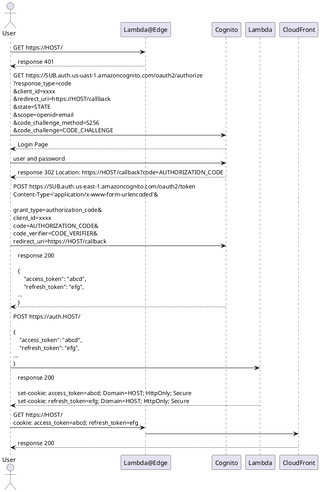

# Practice Manager

演奏会の練習をサポートするためのサービス

## 機能

- 楽譜の書き込みのバージョン管理
- 楽譜の書き込みの共有
- 楽譜への簡易書き込み

## アーキテクチャ


## S3 の構造

- ${bucket_name}
  - ${score_name}
    - meta.json
    - versions
      - ${version_number(/\d{5}/)}
        - ${yyyyMMddHHmmssfff}
          - version.json
          - comments
            - ${page_number}
              - ${yyyyMMddHHmmssfff}
                - comment.json
    - images
      - ${UUID}.${ext}

## dotnet lambda を使用したデプロイ

以下のコマンドでデプロイを実施する

```bash
cd ./backend/PracticeManagerApi/src/PracticeManagerApi
dotnet lambda deploy-serverless
```

この時クラウドフォーメーションのスタック名とクラウドビルドしたバイナリなどを保管する S3 Bucket の名前を聞かれるので入力して実行する。

## Lambda のテスト

Lambda のテストを実行する場合は入力に API Gateway のテンプレートを使用する。
また、 Header で `{"Content-Type": "application/json"}` を指定する必要がある。


## 認証とトークンの保存について


