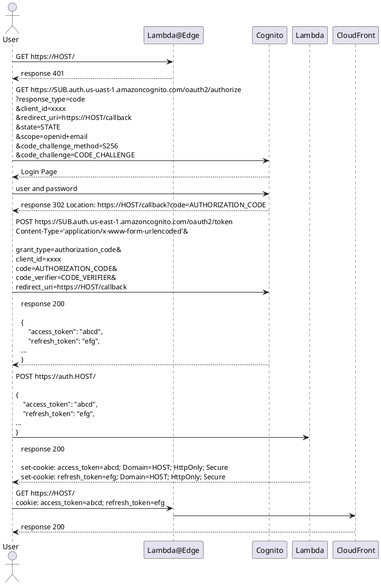

# Practice Manager

演奏会の練習をサポートするためのサービス

## 機能

- 楽譜の書き込みのバージョン管理
- 楽譜の書き込みの共有
- 楽譜への簡易書き込み

## アーキテクチャ



-----------------------------------------------------------------------

## 画面構成

### Home ページ

#### スコア一覧 ページ

ログインしたユーザーが取得できるスコアを一覧で表示する

表示する項目

- タイトル
- 説明の一部

#### スコアの詳細 ページ

スコア一覧で選択したスコアの詳細を表示する

表示する項目

- タイトル
- 説明
- バージョングラフ
  - Version Object hash の上位 8 桁
  - Version message
  - create_at
  - author
- チェックしていない変更一覧

#### バージョン詳細 ページ

スコア詳細で選択したバージョンの詳細を表示する

表示する項目

- Version Object hash の上位 8 桁
- Version message
- create_at
- author
- ページ
  - サムネイル画像一覧
- コメント一覧

#### ページ詳細 ページ

バージョン詳細で選択したページの詳細を表示する

表示する項目

- create_at
- author
- 画像ファイル
- コメント一覧

-----------------------------------------------------------------------

## S3 の構造

### スコアのデータ

- score_bucket
  - ids
    - ${UUID} (Score Ref Object)
  - repositories
    - ${owner}
      - ${score_name}
        - id
        - objects
          - ${hash の上位2桁}
            - ${hash の下位38桁} (Object)
        - HEAD
        - PROPERTY
        - contents
          - ${UUID}@${original_name} (Content File)
        - shared
          - ${user_name} (Shared Object)

#### id

UUID が記録されたテキストファイル

一度付加された UUID は変わらない

```text
${UUID}

```

#### Score Ref Object

UUID に紐づくスコアを記述したテキストファイル

owner が変化したときなどに書き換える

このファイルを利用することでユーザーデータからスコアレポジトリを追跡できる

```text
${owner}/${score_name}

```

#### PROPERTY

スコアの Property Object の hash を1つだけ記述するテキストファイル

#### HEAD

HEAD ファイルは 最新の Version Object の hash を1つだけ記述するテキストファイル

ブランチはサポートせず、まっすぐなグラフになるようにするために Version Object の `parent` がこのファイルに記載されていない場合はコミットを失敗にする。

もし失敗した場合は古い Version Object を参照して作られた Version Object になるので最新のデータを反映させてから再度コミットさせる。

```text
${Version Object hash}

```

#### Object

##### Version Object

```json
{
  "create_at": "${ISO 8601 UTC 拡張形式}",
  "author": "${ユーザー名}",
  "email": "${ユーザーのメールアドレス}",
  "pages": [
    "${Page File hash}"
  ],
  "parent": "${Version Object hash}",
  "message": "${Version メッセージ}"
}
```

##### Page Object

```json
{
  "create_at": "${ISO 8601 UTC 拡張形式}",
  "author": "${ユーザー名}",
  "email": "${ユーザーのメールアドレス}",
  "no": "${ページナンバー}",
  "image_uri": "${ページイメージのURI}",
  "thumbnail_uri": "${サムネイルイメージのURI}",
  "comments":[
    "${Comment File hash}"
  ]
}
```

##### Comment Object

```json
{
  "create_at": "${ISO 8601 UTC 拡張形式}",
  "author": "${ユーザー名}",
  "email": "${ユーザーのメールアドレス}",
  "comment": "${コメント}"
}
```

##### Property Object

スコアの詳細情報。

```json
{
  "create_at": "${ISO 8601 UTC 拡張形式}",
  "author": "${ユーザー名}",
  "email": "${ユーザーのメールアドレス}",
  "title": "${スコアのタイトル}",
  "description": "${説明}"
}
```

#### Content File

ページイメージなど API を経由せずに参照するファイルデータ。

UUID は以下のように計算する。

```csharp
string ComputeUUID() => Guid.NewGuid().ToString("D");
```

#### Shared Object

共有できるユーザー名のファイル。

```json
{
  "shared_at": "${ISO 8601 UTC 拡張形式}"
}
```

### ユーザーのデータ

- user_bucket
  - ${user_name}
    - ${UUID} (Score Ref Object の UUID)
      - checked

#### checked

確認した Hash File の hash

```json
{
  "${Hash File hash}": {
    "checked_at": "${ISO 8601 UTC 拡張形式}"
  }
}
```

-----------------------------------------------------------------------

## ハッシュ値の計算

ハッシュ値は Git のハッシュ計算を使用する

```csharp
string ComputeHash(string type, string contents)
{
  var contentsBytes = System.Text.Encoding.UTF8.GetBytes(contents);
  var headerBytes = System.Text.Encoding.UTF8.GetBytes(type + " " + contentsBytes.Length + "\0");
  
  var buffer = new byte[headerBytes.Length + contentsBytes.Length];
  
  Array.Copy(headerBytes,0,buffer,0,headerBytes.Length);
  Array.Copy(contentsBytes,0,buffer,headerBytes.Length,contentsBytes.Length);
  
  using var sh1 = System.Security.Cryptography.SHA1.Create();
  
  var hash = sh1.ComputeHash(buffer);
  
  var sb = new System.Text.StringBuilder(40);
  for(int i = 0; i < hash.Length; ++i)
  {
    sb.Append(hash[i].ToString("x2"));
  }
  return sb.ToString();
}

var hash = ComputeHash("blob", "hello, world!");
```

-----------------------------------------------------------------------

## dotnet lambda を使用したデプロイ

以下のコマンドでデプロイを実施する

```bash
cd ./backend/PracticeManagerApi/src/PracticeManagerApi
dotnet lambda deploy-serverless
```

この時クラウドフォーメーションのスタック名とクラウドビルドしたバイナリなどを保管する S3 Bucket の名前を聞かれるので入力して実行する。

## Lambda のテスト

Lambda のテストを実行する場合は入力に API Gateway のテンプレートを使用する。
また、 Header で `{"Content-Type": "application/json"}` を指定する必要がある。


## 認証とトークンの保存について


